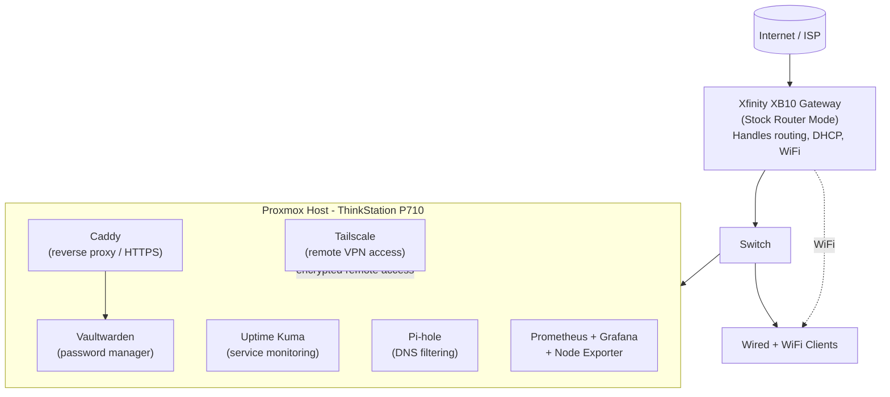
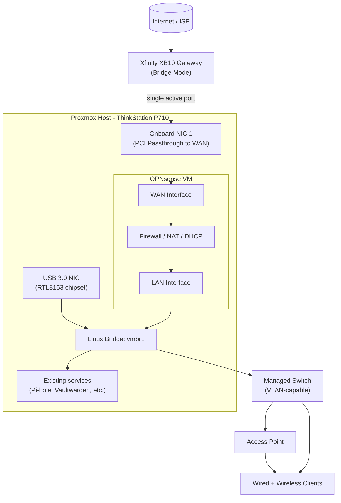

[network-topology.md](https://github.com/user-attachments/files/32673440/network-topology.md)
# Homelab Network Architecture

This covers how my home network is actually set up right now, plus what I'm planning to build next. I wanted to keep these separate so this doc always reflects what's actually running, not just what I've researched or started planning.

## Current State

### What's running and why I set it up this way

**XB10 in stock router mode**
Right now the XB10 is handling all the routing, DHCP, and WiFi itself. It's the ISP's all-in-one gateway, so I haven't swapped it out for my own router yet. It works fine day to day, but it also means the ISP's hardware is making the routing and firewall decisions instead of me, which is the main thing I want to change in the next phase.

**Proxmox running my self-hosted services**
Instead of running a separate machine for every service, I'm using Proxmox on the ThinkStation P710 to run everything as isolated containers/VMs. Right now that includes Pi-hole for network-wide DNS filtering and ad blocking, Uptime Kuma so I actually know when something goes down instead of finding out the hard way, Vaultwarden as my own password manager, Caddy sitting in front of it handling HTTPS, and a Prometheus/Grafana/Node Exporter stack for system metrics with alerts sent to Discord.

**Tailscale for remote access**
This gives me encrypted access into my home network from anywhere without opening ports on the XB10 or exposing anything directly to the internet.

## What's Next: OPNsense

### The plan and why I want to do it

**Why I want to move off the XB10's routing**
Right now the ISP's gateway controls routing and DHCP. Moving that over to OPNsense, running as a VM on the same Proxmox box, means I'm the one setting real firewall rules, building VLANs, and actually seeing what's happening on my own network instead of relying on whatever the stock gateway gives me.

**Bridge mode and PCI passthrough**
I'd switch the XB10 into bridge mode so it just becomes a modem, then pass a physical NIC straight through to the OPNsense VM for WAN. That keeps WAN traffic from having to go through an extra layer of virtual switching.

**Managed switch and VLANs**
A managed switch would let me split devices into their own networks, like keeping IoT or guest devices separate from my trusted devices. I don't have this yet, but it's the reason I'd pay a bit more for managed over unmanaged when I get one.

**Where this stands:** Haven't started this yet. It's the next big project after what's already running above.
